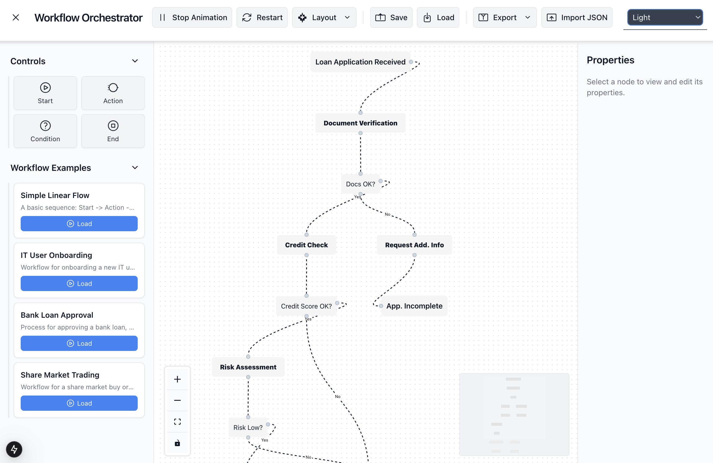

# Workflow Orchestrator

A modern, interactive web application for designing, visualizing, and managing complex workflows. Built with Next.js, React Flow, and Tailwind CSS.

[](https://via.placeholder.com/1200x600.png?text=Workflow+Orchestrator+App+Screenshot+Here)
*Replace the placeholder above with a screenshot or GIF of your application!*



## ✨ Features

The Workflow Orchestrator comes packed with features to streamline your workflow design process:

*   🎨 **Visual Workflow Canvas**: An intuitive drag-and-drop interface powered by React Flow for designing and visualizing workflows.
*    **Versatile Node Types**:
    *   **Start Node**: Clearly define the entry point of any workflow.
    *   **Action Node**: Represent individual tasks, operations, or process steps.
    *   **Condition Node**: Implement decision points and branching logic with true/false outcomes.
    *   **End Node**: Mark the termination points of your workflow paths.
*    **Intelligent Edge Connections**:
    *   Connect nodes to define the sequence and dependencies within your workflow.
    *   Built-in connection validation rules (e.g., Start nodes cannot have incoming connections).
    *   Support for handle-specific connection limits for precise flow control.
*    **Dynamic Properties Panel**:
    *   Select any node on the canvas to instantly view and edit its properties (e.g., label, background color).
    *   Changes are reflected in real-time.
*    **Powerful Toolbar Controls**:
    *   **Automatic Layout**: Neatly arrange complex workflows with a single click, offering both **Vertical (Top-to-Bottom)** and **Horizontal (Left-to-Right)** layout algorithms.
    *   **Edge Animations**:
        *   **CSS Dashed Animation**: Toggle a classic animated dashed line effect on edges.
        *   **SVG Dot Flow Animation**: Activate a sophisticated SVG animation showing a dot traversing the edge path, perfect for visualizing data or message flow.
    *   **Local Storage Persistence**: Save your current workflow design to your browser\'s local storage and easily load it back in a future session.
*    **Theming**:
    *   **Light & Dark Modes**: Switch between themes for optimal viewing comfort in any environment.
    *   UI elements dynamically adapt to the selected theme.
*    **Comprehensive Sidebar**:
    *   **Collapsible Sections**: Keep your tools and options organized and accessible.
    *   **Node Palette**: Easily drag and drop new nodes onto the canvas.
    *   **Workflow Examples**: Load pre-defined example workflows to quickly get started or explore various features.
*    **Node Management**:
    *   **Contextual Toolbar**: Appears on node selection, providing quick access to actions.
    *   **Duplicate Node**: Quickly create copies of existing nodes.
    *   **Delete Node**: Remove nodes from the canvas with ease.

---

This is a [Next.js](https://nextjs.org) project bootstrapped with [`create-next-app`](https://nextjs.org/docs/app/api-reference/cli/create-next-app).

## Getting Started

First, run the development server:

```bash
npm run dev
# or
yarn dev
# or
pnpm dev
# or
bun dev
```

Open [http://localhost:3000](http://localhost:3000) with your browser to see the result.

You can start editing the page by modifying `app/page.tsx`. The page auto-updates as you edit the file.

This project uses [`next/font`](https://nextjs.org/docs/app/building-your-application/optimizing/fonts) to automatically optimize and load [Geist](https://vercel.com/font), a new font family for Vercel.

## Learn More

To learn more about Next.js, take a look at the following resources:

- [Next.js Documentation](https://nextjs.org/docs) - learn about Next.js features and API.
- [Learn Next.js](https://nextjs.org/learn) - an interactive Next.js tutorial.

You can check out [the Next.js GitHub repository](https://github.com/vercel/next.js) - your feedback and contributions are welcome!

## Deploy on Vercel

The easiest way to deploy your Next.js app is to use the [Vercel Platform](https://vercel.com/new?utm_medium=default-template&filter=next.js&utm_source=create-next-app&utm_campaign=create-next-app-readme) from the creators of Next.js.

Check out our [Next.js deployment documentation](https://nextjs.org/docs/app/building-your-application/deploying) for more details.
